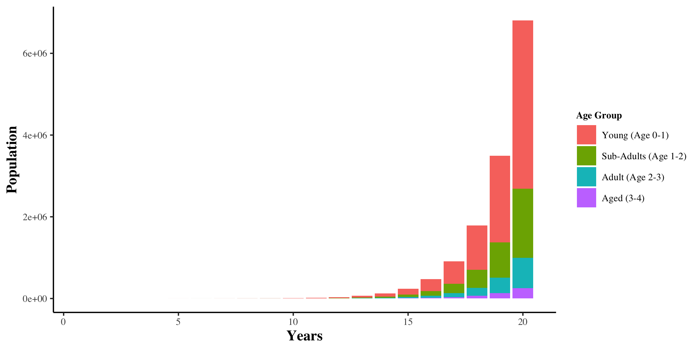

```{r setup, include=FALSE}
knitr::opts_chunk$set(echo = FALSE, warning = FALSE, message = FALSE)

```

```{r}

# Attach packages:
library(tidyverse)
library(sensitivity)
library(ggplot2)
library(janitor)
library(kableExtra)
library(formattable)
library(ggpubr)

```

***

#### **Background**

A small city with a large urban park has decided to introduce a rare species of rabbits into this park - Rabbits are cute and the kids love them, and giving a rare species a new home sounds like a good idea. The urban park manager is concerned about how this rabbit population might grow over the next few decades. Rabbits have no natural predators in the region where the park is situated. The manager would like to know, approximately, how many rabbits there will be 20 years from now if the rabbits are introduced as planned. The manager reviewed the literature and found the following estimates for survival and fertility rates for the rare rabbit population, for 4 different age classes. The estimates for these rates are shown below

**Fertility (rabbit/female) - Survivability**

* Young (Age 0-1) - 0 - 0.8
* Sub-Adults (Age 1-2) - 2 - 0.85
* Adult (Age 2-3) - 6 - 0.65
* Aged (Age 3-4) - 1 - 0.1

```{r}

nclasses = 4

# create a growth matrix to store fertility and survivability information
gmatrix=matrix(nrow=nclasses, ncol=nclasses)

# change NAs to zero
gmatrix[]=0.0

# assign values for fertility for each of the age classes 
# notes that fertility rates are births per capita (number in class) per
# time step - time step here is years 
fert =  c(0,2,6,1)

# enter into our matrix
gmatrix[1,]=fert
 
# now add survivability 
# survivability (to the next class) is also per time step
gmatrix[2,1]=0.8
gmatrix[3,2]=0.85
gmatrix[4,3]=0.65

# we als want to to account for the oldest population group - they don't transfer to another group
# but they do die - this will be survivability per time step but they just stay in their class/group
gmatrix[4,4]=0.1

# Check tables:
#gmatrix

```


```{r}

source("./R/evolve_pop.R")

# initial population parameters
ini = c(0,0,10,0)
nyears = 20
fert_rabbit = c(0,2,6,1)
surv_rabbit = c(0.8,0.85,0.65,0.1)
rabbit_pop=evolve_pop(fert_rabbit, surv_rabbit, ini, nyears)

# Check values:
#tail(rabbit_pop)

# Total population in year 20
total_pop_20 <- rabbit_pop$poptot[20]

# graph different components of the output
# plot information about ages
# add years 
year = seq(from=1, to=nyears)
rabbit_ages = cbind.data.frame(year=year, t(rabbit_pop$popbyage))
rabbit_agesl = rabbit_ages %>% gather(key="agecat", value="pop",-year)
plot.1 <- ggplot(rabbit_agesl, aes(year, pop,fill=agecat))+
  geom_col()+labs(y="Population",x="Years",fill="Age Group")+
  scale_fill_discrete(name = "Age Group", labels = c("Young (Age 0-1)", "Sub-Adults (Age 1-2)", "Adult (Age 2-3)", "Aged (3-4)"))+
  theme_classic()+
  theme(text = element_text(family = "serif"),
        axis.title.x = element_text(size=12, face="bold"),
        axis.title.y = element_text(size=12, face="bold"),
        axis.text.x = element_text(size=8),
        axis.text.y = element_text(size=8),
        legend.text = element_text(size = 8),
        legend.title = element_text(size=8, face="bold"),
        legend.position = "right",
        legend.justification = "left",
        legend.box = "vertical", 
        legend.box.just = "left")
# Save plot
ggsave(plot = plot.1, width = 8, height = 4, filename = "figures/plot.1.png")

```

**Assume that we start with 10 adults rabbits.**

* The total rabbit population after 20 years is **`r total_pop_20`**.
* There are **`r  rabbit_ages%>%select(2)%>%slice(20)%>%pull`** young rabbits (first age class) in the population at that time.

```{r}

# Make a table of the variables and calculated yield
table.1 <- rabbit_ages %>% 
  clean_names() %>% 
  slice(20) %>% 
  # Rename columns
  rename("Year" = year,
         "Young (Age 0-1)" = x1,
         "Sub-Adults (Age 1-2)" = x2,
         "Adult (Age 2-3)" = x3,
         "Aged (Age 3-4)" = x4) %>% 
  pivot_longer(!Year, names_to = "age_group", values_to = "pop") %>% 
   # Add gradient color scale to columns 
  mutate(pop = color_tile("#DeF7E9", "#71CA97")(pop)) %>% 
  select(age_group, pop) %>% 
  # Rename columns
  rename("Age Group" = age_group,
         "Population" = pop) %>% 
  kable(escape = FALSE, align = c("c","c")) %>% 
  kable_styling() %>% 
  column_spec(1:2, color = "black") %>% 
  # Save table
  save_kable(file = "figures/table.1.png")
  
```

```{r}

library(sensitivity)

# survivability - based on mortality rates per thousand per decade
nsample=200

# create our two samples for Sobel
# first do our survivability

ps1 = cbind.data.frame(p1=runif(min=0.65, max=0.75, n=nsample), 
                       p2=runif(min=0.75, max=0.80, n=nsample))

ps2 = cbind.data.frame(p1=runif(min=0.65, max=0.75, n=nsample), 
                       p2=runif(min=0.75, max=0.80, n=nsample))

# get sobel samples
sens_rabbit=soboljansen(model = NULL, ps1, ps2, nboot = 100)

# Check values:
#head(sens_rabbit$X)
nsim=nrow(sens_rabbit$X)

# Survivalbility
p3 = 0.65
p4 = 0.1

# Fertility
f1 = 0
f2 = 2
f3 = 6
f4 = 1

# run model and save what we care about: final population after 20 years 

ini = c(0,0,10,0)
nyears = 20

# combine our application of the the dynamics model
# parameter set, with code to extract metric of interest (final population)
p_wrapper = function(p1,p2,p3,p4,f1,f2,f3,f4,
                     use_func,initialpop,nstep ) {
fertility=c(f1,f2,f3,f4)
survivability= c(p1,p2,p3,p4)
res = use_func(survivability =survivability, fertility = fertility, initialpop=initialpop, nstep=nstep)
# now return the final population total
return(finalpop=res$poptot[nstep])
}

# use pmap here so we can specify rows of our sensitivity analysis parameter object 

res = as.data.frame(sens_rabbit$X) %>% pmap_dbl(p_wrapper, initialpop=ini, nstep=nyears, use_func=evolve_pop,p3=p3,p4=p4,f1=f1,f2=f2,f3=f3,f4=f4)

         
# plot results (variation in final population across all parameter)
plot.2 <- ggplot(data.frame(finalpop=res), aes(x=finalpop))+geom_density()+
  labs(y="Density",x="Population After 20 Years")+
  theme_classic()+
  theme(text = element_text(family = "serif"),
        axis.title.x = element_text(size=12, face="bold"),
        axis.title.y = element_text(size=12, face="bold"),
        axis.text.x = element_text(size=8),
        axis.text.y = element_text(size=8),
        legend.text = element_text(size = 8),
        legend.title = element_text(size=8, face="bold"),
        legend.position = "right",
        legend.justification = "left",
        legend.box = "vertical", 
        legend.box.just = "left")
# Save plot
ggsave(plot = plot.2, filename = "figures/plot.2.png")

# or a boxplot
plot.3 <- ggplot(data.frame(finalpop=res), aes(x="", y=finalpop) )+geom_boxplot(fill="#71CA97", alpha=0.8)+
  theme(axis.title.x = element_blank())+labs(y="Population After 20 Years")+
  theme_classic()+
  theme(text = element_text(family = "serif"),
        axis.title.x = element_text(size=12, face="bold"),
        axis.title.y = element_text(size=12, face="bold"),
        axis.text.x = element_text(size=8),
        axis.text.y = element_text(size=8),
        legend.text = element_text(size = 8),
        legend.title = element_text(size=8, face="bold"),
        legend.position = "right",
        legend.justification = "left",
        legend.box = "vertical", 
        legend.box.just = "left")
# Save plot
ggsave(plot = plot.3, filename = "figures/plot.3.png")

plot.4 <- ggarrange(plot.2, plot.3, 
          labels = c("A", "B"),
          ncol = 2, nrow = 1)
# Save plot
ggsave(plot = plot.4, width = 8, height = 4, filename = "figures/plot.4.png")

# give our results to sensitivity structure
sens_rabbit=tell(sens_rabbit, res)

# loot at results
#sens_rabbit$S
#sens_rabbit$T

# graph the most sensitive parameter
tmp = cbind.data.frame(sens_rabbit$X, pop1=sens_rabbit$y)

# plot age group 1 sensitivity
plot.5 <- ggplot(tmp, aes(p1, pop1))+geom_point(color = "dodgerblue")+labs(x="Survivability of Young (Age 0-1)",y="Population After 20 Years")+
  theme_classic()+
  theme(text = element_text(family = "serif"),
        axis.title.x = element_text(size=12, face="bold"),
        axis.title.y = element_text(size=12, face="bold"),
        axis.text.x = element_text(size=8),
        axis.text.y = element_text(size=8),
        legend.text = element_text(size = 8),
        legend.title = element_text(size=8, face="bold"),
        legend.position = "right",
        legend.justification = "left",
        legend.box = "vertical", 
        legend.box.just = "left")
# Save plot
ggsave(plot = plot.5, filename = "figures/plot.5.png")

# plot age group 2 sensitivity
plot.6 <- ggplot(tmp, aes(p2, pop1))+geom_point(color = "tomato")+labs(x="Survivability of Sub-Adults (Age 1-2)",y="Population After 20 Years")+
  theme_classic()+
  theme(text = element_text(family = "serif"),
        axis.title.x = element_text(size=12, face="bold"),
        axis.title.y = element_text(size=12, face="bold"),
        axis.text.x = element_text(size=8),
        axis.text.y = element_text(size=8),
        legend.text = element_text(size = 8),
        legend.title = element_text(size=8, face="bold"),
        legend.position = "right",
        legend.justification = "left",
        legend.box = "vertical", 
        legend.box.just = "left")
# Save plot
ggsave(plot = plot.6, filename = "figures/plot.6.png")

plot.7 <- ggarrange(plot.5, plot.6, 
          labels = c("A", "B"),
          ncol = 2, nrow = 1)
# Save plot
ggsave(plot = plot.7, width = 8, height = 4, filename = "figures/plot.7.png")

```

```{r}

# sobol can only handle one output at a time  - so we will need to do them separately

sens_rabbit_pop = sensitivity::tell(sens_rabbit,tmp$pop1)

# first-order indices (main effect without co-variance)
#sens_rabbit_pop$S

# total sensitivity index 
#sens_rabbit_pop$T

# Plot
#plot(sens_rabbit_pop)


```

***



***


***

#### **Sensitivity**

The park manager is also thinking of ways to keep the population under control - by encouraging nesting of hawks that eat the rabbits. 

Hawks generally only eat  younger rabbits- thus they reduce the survivability of the young and sub-adults age classes (the first two classes).  The estimates are that survivability reduced to between 0.65 and 0.75 for Ages 0-1 and between 0.75 and 0.8 for Ages 1-2. We can assume that distributions are uniform.

A sensitivity analysis on the survivability of Young Age and Sub-Adults age class parameters was run using Sobel to generate variation in the survivability parameters. Then for each parameter set, total rabbit population after 20 years was calculated.

***

**Variation in total rabbit population.**


***

**Plot of how total rabbit population after 20 years varies with A) survivability of Young Age and B) Sub-Adult.**


***

#### **Disscusion:**

How does this compare with total rabbit population after 20 years in your original population model (without the hawk related change to survivability)?

***
